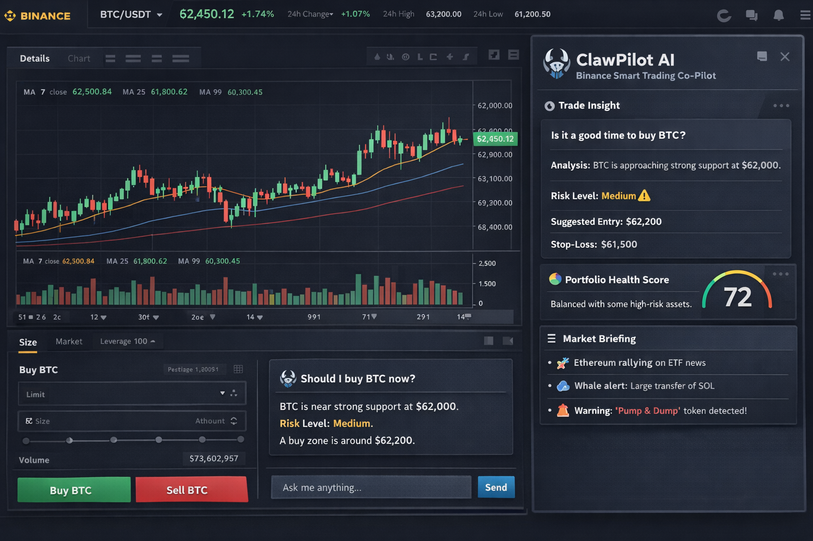

# clawpilot-ai-binance-assistant
ClawPilot AI is an intelligent trading assistant designed to enhance the Binance experience. It provides real-time trade insights, portfolio health analysis, market briefings, and risk alerts to help users make smarter crypto trading decisions through a simple AI-powered interface.
ClawPilot AI — Binance Smart Trading Co-Pilot
ClawPilot AI is an intelligent assistant designed to enhance the trading experience on Binance by providing real-time insights, risk analysis, and AI-powered trading guidance.
The project demonstrates how an AI assistant can simplify crypto trading by analyzing market data, portfolio exposure, and sentiment signals to help users make smarter decisions.
🚀 Features
AI Trade Insights
Provides real-time trading suggestions based on market conditions.
Entry and exit zone recommendations
Stop-loss and take-profit suggestions
Trade risk evaluation
Portfolio Health Score
Analyzes the user's portfolio and generates a risk & diversification score.
Asset allocation analysis
Volatility exposure
Risk concentration warnings
AI Market Briefing
Summarizes key crypto market developments.
Trending tokens
Whale activity alerts
Market sentiment analysis
Major crypto news summaries
Risk & Scam Protection
Detects suspicious or high-risk trading activity.
Pump-and-dump detection
Extreme volatility alerts
High liquidation risk warnings
AI Crypto Tutor
Built-in assistant that explains trading concepts in simple terms.
Examples:
“What is RSI?”
“Explain this chart”
“Why is BTC going up?”
🧠 How It Works
ClawPilot AI combines multiple AI components:
Market data analysis
Sentiment analysis from crypto news and social media
Portfolio risk assessment models
Natural language AI assistant
The AI processes these signals and generates clear, actionable insights directly inside the trading interface.
🎯 Goal
The goal of this project is to demonstrate how AI can make crypto trading:
more accessible for beginners
safer through risk detection
more efficient for experienced traders
ClawPilot AI transforms a traditional trading platform into a smart AI-assisted trading environment.
Demo
See the demo interface below showing the ClawPilot AI assistant integrated into a trading dashboard.

🔮 Future Development
Potential future improvements include:
voice trading assistant
automated portfolio rebalancing
advanced on-chain analytics
personalized trading strategies
🏆 Hackathon Submission
This project was created as a concept for the OpenClaw AI Assistant Challenge, exploring how AI agents can improve the user experience and decision-making within crypto trading platforms.
